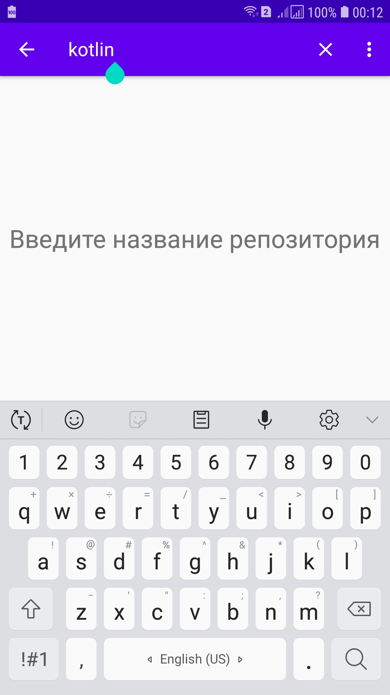
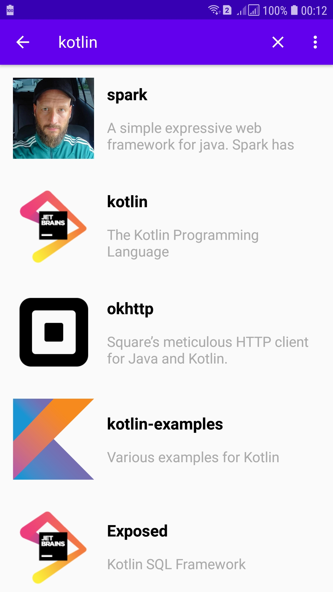
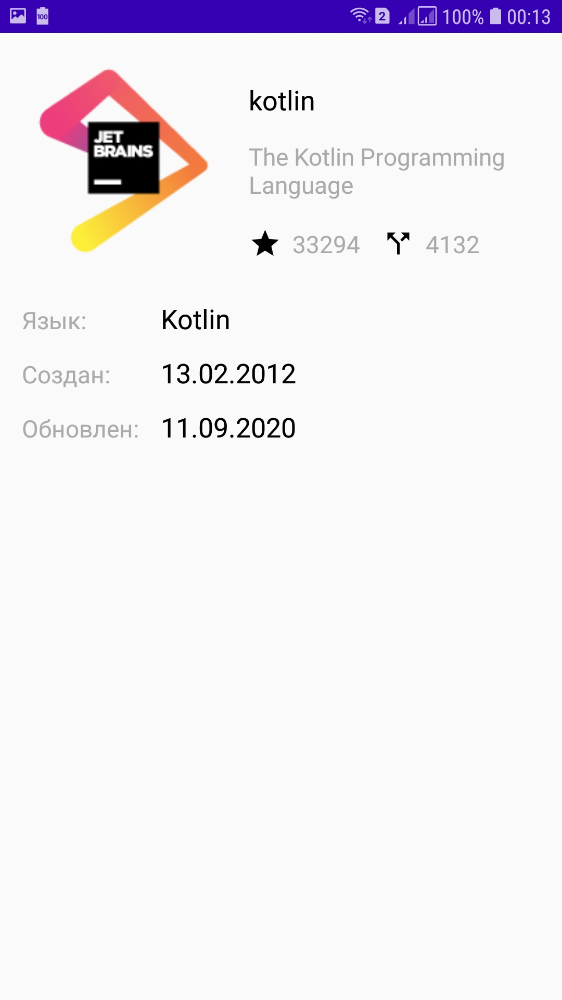
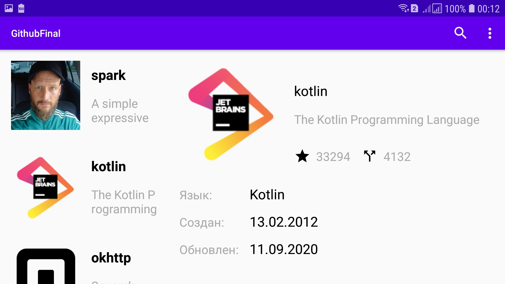

## GithubFinal
#### Final work. Devcolibri online course ["Android for advanced"](https://devcolibri.com/course/android-advanced). The application searches for a repository by name on GitHub.

**Used:**
* MVVM
* Dagger 2
* Retrofit
* Gson
* Room
* Search view 
* Fragments
* RxJava 2

____
  
 
